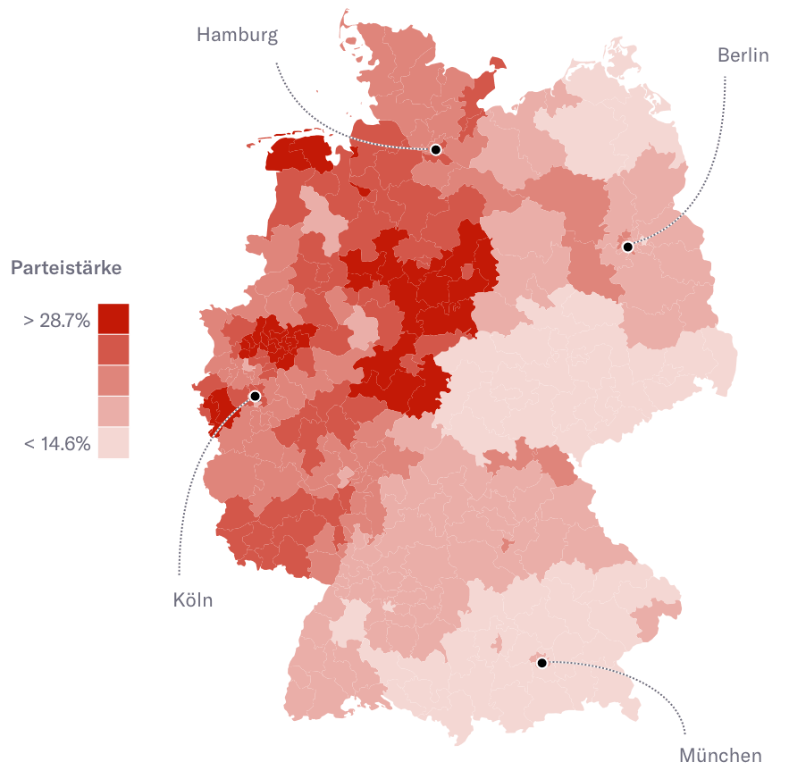

## Konzept für ein Tool um Choropleth Karte zu erstellen

Dieses Repository enthält ein Konzept für ein Tool, das es jedem Journalisten erlaubt Choropleth Karten zu erstellen.

### Was ist eine Choropleth Karte?
Choropleth Karten können zur Visualisierung eines Messwerts auf einer geographischen Fläche verwendet werden. Im folgenden Beispiel stammt aus einem [Artikel](https://www.nzz.ch/international/bundestagswahl-deutschland-wo-die-parteien-gewonnen-haben-wo-sie-verloren-haben-ld.1316297) der NZZ und zeigt die Wahlanteil der SPD in den verschiedenen Region Deutschlands.

### Anforderungen
Dieser Abschnitt beschreibt die funktionalen und nicht-funktionalen Anforderungen an das Tool.

#### Funktional
- Karten sollen historisch verfügbar sein (Länder-/Kantons-/Gemeindegrenzen ändern sich mit der Zeit)
- Karten sollen ohne viel Aufwand auch für Print verwendet werden können
- *Karte der Welt, der einzelnen Kontinente, Länder und Regionen/Provinzen soll zur Auswahl stehen*
- *Daten können als CSV importiert werden und nachträglich bearbeitet werden*
- *Titel, Beschreibung, Bemerkungen und Quelle kann zu Karte hinzugefügt werden*
- *Farben:*
    - *Unterschiedliche Farbpaletten sollen zur Auswahl stehen (zBsp. Graustufen, für Farbenblinde, printfreundlich, basierend auf Design Guidelines) -> siehe [ColorBrewer](http://colorbrewer2.org) oder [Viridis R Package](https://cran.r-project.org/web/packages/viridis/vignettes/intro-to-viridis.html) als Inspiration*
    - *Farbtransparenz soll anpassbar sein*
    - *Randfarbe der Regionen soll anpassbar sein*
- *Abstufung/Klassen:*
    - *Auf Daten basierende Abstufungen (min/max, min/median/max, quartiles, quintiles, decile)*
    - *Abstufung soll auch manuell definiert werden können*
    - *[Pritty-Breaks](https://stat.ethz.ch/R-manual/R-devel/library/base/html/pretty.html) - schöne Abstufung ohne Kommazahlen*
- *Tooltip Text sollen anpassbar sein*
- *Legende soll automatisch anhand der Abstufung erstellt werden und Position/Titel der Legende kann angepasst werden*

#### Nicht-funktional
- Es sollen möglichst wenige Daten zum Client übertragen werden, um die Karte zu anzuzeigen
- Die Karte soll auf dem Endgerät möglichst schnell angezeigt werden

### Umsetzung

#### Mögliche Datenquellen
- Swisstopo's [swissBOUNDARIES3D](https://shop.swisstopo.admin.ch/de/products/landscape/boundaries3D) - Landes-, Kantons-, Bezirks- und Gemeindegrenzen - **jährlich aktualisiert**
- [GADM.org](http://gadm.org) - Sammlung administrativer Grenzen aller Länder (teilweise auch Provinzen vorhanden) - **letzte Aktualisierung November 2015 (neue Version in Umsetzung)**
- [World Atlas](https://github.com/topojson/world-atlas) - Projekt um Ländergrenzen in TopoJSON aus [Natural Earth Datensatz](http://www.naturalearthdata.com/) zu erstellen
- [US Atlas](https://github.com/topojson/us-atlas) - Projekt um US Staatengrenzen TopoJSON aus USA Behördendaten zu erstellen
- Selbe Methodik könnte angewendet werden um TopoJSON für Welt, Kontinent, Länder und Provinzen zu erstellen, jedes Mal mit dem genauesten verfügbaren Dataensatz (Behördendaten, Natural Earth, OpenStreetMap)

**-> Weitere Abklärungen nötig: Welche Karten sind alle von nutzen?- Wie genau müssen die Daten sein?- Wie aktuell müssen die Daten sein?**

#### Datenformat der Geoinformationen - GeoJSON vs. TopoJSON
- [TopoJSON](https://github.com/topojson/topojson/wiki) ist eine Erweiterung von [GeoJSON](http://geojson.org/)
- Geoinformationen werden intelligent kodiert:
    - kombiniert angrenzende Geometrien, verringert Redundanz
    - vereinfacht Geometrien
- **Verringert Dateigrösse, je nach Daten bis zu 80%**

#### Lösungsansatz 1 Clientside Rendering
- [D3.js](https://d3js.org/) und [TopoJSON](https://github.com/topojson/topojson) Library
    - Grösse Beispielprojekt: 91.6KB
    - Viele Beispiel Karten auf [bl.ocks.org](http://bl.ocks.org) verfügbar, professionelle Community, erweiterbar
    - Möglich Interaktive Karten zu erstellen
    - Gut dokumentiert
- [Leaflet](http://leafletjs.com/) und [TopoJSON](https://github.com/topojson/topojson) Library
    - Grösse Beispielprojekt: 49.6KB
    - Choropleth Beispiel: http://leafletjs.com/examples/choropleth/
    - Möglich Interaktive Karten zu erstellen, erweiterbar, stylebar
    - Gut dokumentiert

#### Lösungsansatz 2 Serverside Rendering
- Library wie [D3-Node](https://github.com/d3-node/d3-node) verwenden, welches nur gerendertes SVG ausliefert
    - Nur statische Karten möglich
    - Client muss nur SVG rendern im Gegensatz zum Lösungsansatz 1
    - Daten die von Client geladen werde muss, muss nicht zwingend kleiner sein als bei Lösungsansatz 1
- Serverseitig generiertes PNG
    - R Workflow verwenden wie zum Beispiel Timo Grossenbacher in [seinem Blog Post](https://timogrossenbacher.ch/2016/12/beautiful-thematic-maps-with-ggplot2-only/) beschrieben hat
    - Daten die von Client geladen werde muss, kann auch hier schnell grösser sein als bei Lösungsansatz 1
    - Export in Vektorgrafik einfach möglich für Import in Illustrator -> gebrauch in Print
    - Keine Interaktion mit Grafik möglich

#### Serverside Rendering vs. Clientside Rendering Diskussion
- Tools wie D3-Node ermöglichen es D3-Grafiken auf Serverseite zu generieren und nur SVG auszuliefern
- Das muss aber nicht zwingend heissen, dass serverseitig gerendertes SVG/PNG kleiner ist als clientseitig gerenderte Grafik (D3.js und TopoJSON library, Geodaten, Daten für Karte)
- Beispielprojekte:
    - [Clientseitig(D3.js, TopoJSON)](https://bl.ocks.org/mbostock/raw/4060606/),, **364KB**
    - [Serverseitig(D3-Node)](https://github.com/d3-node/d3node-map-choropleth-france), **619KB**
- Serverseitiges Rendern ist zudem nur für statische Karten zu gebrauchen, wohingegen clientseitiges Rendern Interaktion mit der Karte ermöglicht

**-> Weitere Abklärungen nötig: Interaktion mit Karte nötig?- Beispiele direkt gegenüber stellen (Was ist schneller?- Kleinerer Downloadgrösse dafür Rendern auf Client oder grösserer Download dafür direkte Anzeige von SVG/PNG)**

#### Recherche verschiedener Choropleth Karten
- [Blog Post](https://timogrossenbacher.ch/2016/12/beautiful-thematic-maps-with-ggplot2-only/) Timo Grossenbacher Choropleth Karte mit R erstellen
- SRF Data SBB GA/Halbtax -> [Endergebnis](https://srfdata.github.io/2017-09-sbb-ga-halbtax/#deskriptive_statistik) und [Code](https://www.srf.ch/news/schweiz/pendlerland-schweiz-hier-verkaufen-sich-ga-und-halbtax-am-besten)
- [Einfaches Beispiel](http://journocode.com/2017/08/16/datajournalism-workflow-ddj-r-rstats-rstudio-dplyr-ggplot2-tidyr/) mit R zu Choropleth Karte von Journocode
- NZZ Storytelling Choropleth Karten
    - Wahlen Österreich / Interaktive Choropleth Karte mit Hilfe von [Datawrapper(D3.js, TopoJSON)](https://www.datawrapper.de/) -> [Artikel](https://www.nzz.ch/international/nationalratswahl-2017-so-hat-oesterreich-gewaehlt-alle-resultate-im-ueberblick-ld.1320312), [Karte](https://datawrapper.dwcdn.net/qz83I/2/), Grösse Karte: 2.5MB
    - Meisten sind als PNG’s veröffentlicht (nicht interaktiv): [Bundestagswahlen](https://www.nzz.ch/international/bundestagswahl-deutschland-wo-die-parteien-gewonnen-haben-wo-sie-verloren-haben-ld.1316297), [Frankreich Wahlen](https://www.nzz.ch/international/frankreich-hat-gewaehlt-die-linie-marseillele-havre-ld.1291610), meist zwischen 600KB - 1.5MB gross

#### Karte für Print verwenden
- Cloud Service wie [CloudConvert](https://cloudconvert.com/svg-to-eps) nutzen, um SVG in ein printfähiges Format zu konvertieren
- Headless Chrome verwenden um PDF’s zu erstellen   - Problem CMYK Farben
    - Mögliche Lösung: Nur printfähige Farbpaletten anbieten -> siehe [ColorBrewer](http://colorbrewer2.org) als Inspiration
- R Workflow verwenden und zusätzlich zu PNG/SVG für Web, eine vektorielle Version für Print generieren
